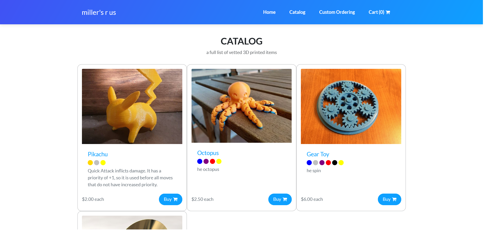

# nhs-store
The website of the AACT NHS chapter, providing an foundation for various chapter activities.

It is currently available at [aact-nhs.herokuapp.com](aact-nhs.herokuapp.com/) and currently redirects to the online store. All products and product images currently available on the website are placeholders only, and will be replaced with actual items once the physical store has been set up.

## Deployment
- Hosting provided by Heroku.
- Media hosting provided by Microsoft Azure.
- Error reporting provided by Sentry.
- Database uses Postgres.

## Setup
- Run `pip install -r requirements.txt`
- Rename `template.env` to `.env` and fill in envvars as needed. You may want to disable certain features or libraries, such as Azure or Sentry integrations, by clearing relevant lines in settings.py.
- From `\src\nhssite`, run `python manage.py migrate`.
- Run `python manage.py runserver`.